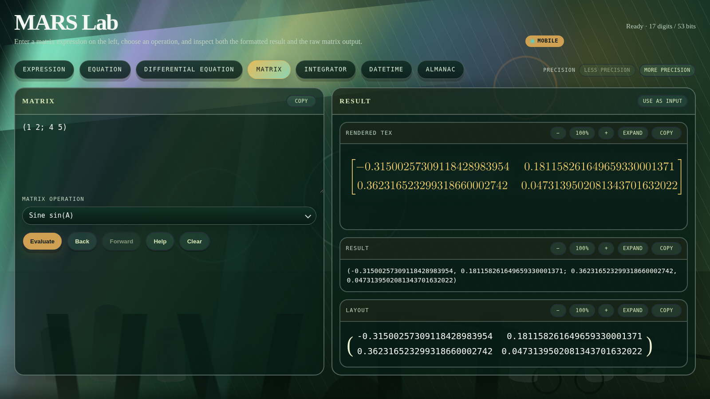

# MARS


[](LICENSE)


MARS is a Linux-focused C99/GNU C library for high-precision numerics,
symbolic differentiation, reverse-mode automatic differentiation, symbolic
mathematics, datetime utilities, UTF-8 strings and generic containers. It also
includes **MARS Lab**, a local browser-based workspace for using those
facilities interactively.

**Supported build target:** Linux with GCC or Clang. The code intentionally uses
some GNU C extensions, so MSVC/Windows builds are not currently guaranteed.

## Highlights

- **`number_t`** — generic numeric value cluster spanning exact integer/rational,
  fixed-precision, and multiprecision real/complex backends behind one by-value
  public handle
- **`qfloat_t`** — independent double-double arithmetic, circular function
  families and special functions, including Bessel, Lommel, generalised
  hypergeometric, Lauricella, Riemann zeta, Hurwitz zeta, Li₁ and Lerch
  transcendent families
  (~31–32 decimal digits of precision)
- **`qcomplex_t`** — double-double complex arithmetic and complex
  special-function families without an MPFR or MPC dependency
- **`matrix_t`** — generic high-precision matrix over numeric `number_t` values
  or symbolic `expr_t *` entries, with native matrix-expression parsing,
  symbolic powers, ordered higher and mixed derivatives and antiderivatives,
  constant-square-matrix spectral calculus, matrix-wide simplification and
  presentation beautification, symbolic linear algebra, and high-precision
  eigendecomposition and matrix functions through the numeric `number_t` layer
- **`diffequ_t`** — ODE and PDE parsing with rule-based symbolic solving,
  optional derivations, linearisations and symmetry metadata
- **`expr_t`** — differentiable expression DAGs with arbitrary-order symbolic
  derivatives and numeric reverse-mode gradients, Cartesian presentation of
  complex elementary functions, symbolic antiderivatives for conservative rule
  families, native algebraic-series ellipsis expansion, harmonic polynomials,
  trigonometric and hyperbolic progression sums, Riemann and Hurwitz zeta
  calculus, finite sum and product notation, Li₁ and Lerch-transcendent
  calculus, symbolic matrix integration and structural matcher helpers for
  higher-level symbolic code
- **`datetime_t`** — civil and astronomical date/time helpers
- **`timeseries_t`** — datetime-indexed forecasting and time-series analysis for regression and ARIMA-family models
- **`json_t`** — opaque JSON value tree with string-backed parsing, serialisation, file round-tripping, and `number_t` extension support
- **`sqlite_t`** — opaque SQLCipher-backed SQLite storage for encrypted MARS object persistence
- **`dictionary_t` / `set_t` / `array_t`** — generic containers with user-defined ownership
- **`string_t`** — UTF-8-aware dynamic strings and grapheme operations
- **`bitset_t`** — dynamic thread-safe bitset with bitwise operations
- **`integrator_t`** — adaptive G7K15 / Turan T15/T4 integration with symbolic fast paths for affine-family `expr_t` integrands

## MARS Lab

MARS Lab provides an approachable graphical front end to MARSlib. Its seven
workspaces cover expressions, equations, ordinary and partial differential
equations, matrices, symbolic and numerical integration, civil date
calculations and the astronomical almanac. The browser handles presentation;
the mathematical work remains in MARSlib and the MARS helper programs running
locally. Expression mode presents supported functions of `x + iy`, their
derivatives and their antiderivatives in Cartesian `p + qi` form. Explicit
fractional powers retain every root branch, while named root functions remain
single-valued. Native algebraic-series recognition supplies the sigma step and
domain-appropriate closed form, and a Value card appears whenever all required
parameters have been supplied. Finite `sin`, `cos`, `sinh` and `cosh`
progressions are recognised directly; harmonic-polynomial notation supplies a
finite symbolic antiderivative for the cosine progression. Native `@Z` and
`@P` notation supplies formal sums and products. Formal finite trigonometric
and hyperbolic progressions expose the same closed formulae and efficient
values as their ellipsis forms. Weighted hyperbolic sums use a bounded
Li₁/Lerch representation, stable direct values and an inverse calculus
simplification that recovers their finite-sum derivative.

After building MARS and installing the Lab's runtime dependencies, start it
from the repository root:

```sh
make mars-lab
```

```text
MARS Lab running at http://localhost:<port>/
Press Ctrl+C to stop.
```

[](docs/images/mars-lab/matrix.png)

Use `make mars-lab-stop` to stop a background Lab process and
`make mars-lab-restart` to rebuild and relaunch it.

See the [MARS Lab guide](docs/mars-lab.md) for installation details, notation,
worked examples, all seven modes and private mobile access through Tailscale.

## Requirements

- GCC or Clang on Linux, compiling C99/GNU C
- Standard C library plus `libm` and pthreads
- GMP, MPFR, and MPC development libraries
- SQLCipher development libraries
- Optional `libunistring` support for the UTF-8/string layer (`ENABLE_UNISTRING=1` by default in the Makefile)

On Debian/Ubuntu, install the default build requirements with:

```sh
sudo apt install build-essential libgmp-dev libmpfr-dev libmpc-dev libsqlcipher-dev libunistring-dev
```

Use `make check-deps` to check for required development headers and link
libraries before building or installing.

MARS Lab requires Python 3.10 or later, using only its standard library, and
renders TeX through `latex` and `dvisvgm`. The desktop Lab uses the `sqlcipher`
CLI to bootstrap the jurisdiction database during installation. Install the
runtime tools and check them with:

```sh
sudo apt install python3 texlive-latex-base dvisvgm sqlcipher
make check-lab-deps
```

## Benchmark Highlights

Recent sample benchmarks on this tree show:

- symbolic integrator shortcuts and antiderivative rules reducing supported
  affine-family cases from fallback-style tens of milliseconds to
  low-hundreds of microseconds
- `affine_square` at about `233.723 µs` versus `near_miss_square` at about
  `1647.171 µs`
- `affine_times_exp` at about `77.678 µs` versus `near_miss_exp` at about
  `49084.036 µs`
- symbolic `expr` matrix solve for a dense `3x3` / `2`-RHS case at about
  `6000.421 µs`
- symbolic `expr` matrix inverse for a dense `4x4` case at about
  `40635.324 µs`
- `qfloat_t` `gamma(2.3)` at about `1.246 µs` and `lgamma(2.3)` at about
  `3.797 µs`
- `qfloat_t` `gammainv(119292.4619946090070787515047110059)` at about
  `82.548 µs`
- `qcomplex_t` `qc_exp(1+i)` at about `2.513 µs` and `qc_log(1+i)` at about
  `3.503 µs`
- `qcomplex_t` `gammainv(qc_gamma(2.5+0.3i))` at about `145.943 µs`

See [`docs/benchmarks.md`](./docs/benchmarks.md) for commands, units, and fuller
sample output.

## Quick Examples

**High-precision arithmetic with `qfloat_t`:**

```c
#include <stdio.h>
#include "qfloat.h"

int main(void) {
    qfloat_t x = qf_from_string("1");
    qfloat_t w = qf_lambert_w0(x);

    qf_printf("W0(1) = %.34q\n", w);
    return 0;
}
```

```text
W0(1) = 0.5671432904097838729999686622103575
```

**Multiprecision arithmetic with `number_t`:**

```c
#include <stdio.h>
#include "number.h"

int main(void) {
    number_t x;
    number_t gamma_x;
    number_t lgamma_x;
    char buf[256];

    num_set_default_prec_bits(256);
    x = num_create_from_string("2.345");
    gamma_x = num_gamma(x);
    lgamma_x = num_lgamma(x);

    num_sprintf(buf, sizeof(buf), "%.77n", gamma_x);
    printf("gamma(2.345)  = %s\n", buf);

    num_sprintf(buf, sizeof(buf), "%.77n", lgamma_x);
    printf("lgamma(2.345) = %s\n", buf);

    num_destroy(&lgamma_x);
    num_destroy(&gamma_x);
    num_destroy(&x);
    return 0;
}
```

```text
gamma(2.345)  = 1.1992978294153192855268153358879569120923525584905703781289979370034378685904
lgamma(2.345) = 0.18173624337757203797862933229995978550118791690492470651875093221924437275614
```

**Generic numeric arithmetic with `number_t`:**

```c
#include <stdio.h>
#include "number.h"
#include "ustring.h"

int main(void) {
    number_t a = num_create_from_string("2");
    number_t b = num_create_from_string("5/6");
    number_t c = num_add(a, b);
    string_t *text = num_to_string(c);

    if (!text)
        return 1;

    printf("2 + 5/6 = %s\n", string_c_str(text));

    string_free(text);
    num_destroy(&a);
    num_destroy(&b);
    num_destroy(&c);
    return 0;
}
```

```text
2 + 5/6 = ¹⁷⁄₆
```

For temporary-heavy internal code, `number_t` also supports optional lifetime
scopes. The intended fast pattern is to keep short-lived intermediates inside
the active scope while keeping rolling or returned values as ordinary owned
`number_t` results. See [`docs/number.md`](./docs/number.md) for the scope
semantics and the `bench_number_scope` benchmark notes.

**Automatic differentiation with `expr_t`:**

```c
#include <stdio.h>
#include "expression.h"
#include "number.h"

/* f(x) = exp(sin(x)) + 3*x^2 - 7 */
static expr_t *make_f(expr_t *x) {
    number_t two = num_create_from_long(2);
    number_t three = num_create_from_long(3);
    number_t seven = num_create_from_long(7);
    expr_t *sinx   = expr_sin(x);
    expr_t *exp_sx = expr_exp(sinx);
    expr_t *x2     = expr_pow(x, &two);
    expr_t *term2  = expr_mul_num(x2, &three);
    expr_t *f0     = expr_add(exp_sx, term2);
    expr_t *f      = expr_sub_num(f0, &seven);

    expr_free(sinx);
    expr_free(exp_sx);
    expr_free(x2);
    expr_free(term2);
    expr_free(f0);
    num_destroy(&two);
    num_destroy(&seven);
    num_destroy(&three);

    return f;
}

int main(void) {
    number_t x0 = num_create_from_string("1.25");
    expr_t *x;
    expr_t *f;
    expr_t *df_dx;
    const expr_t *d2f_dx;
    number_t f_val;
    number_t d1_val;
    number_t d2_val;

    num_set_default_prec_bits(384);
    x = expr_new_named_var(x0, "x");
    num_destroy(&x0);
    f = make_f(x);
    df_dx = expr_create_deriv(f, x);
    d2f_dx = expr_get_deriv(df_dx, x);

    printf("f(x)    = "); expr_print(f);
    printf("f'(x)   = "); expr_print(df_dx);
    printf("f''(x)  = "); expr_print(d2f_dx);

    f_val = expr_eval(f);
    d1_val = expr_eval(df_dx);
    d2_val = expr_eval(d2f_dx);

    printf("\nAt x = 1.25 (384 bits, %zu significant digits):\n",
           num_get_prec_digits(f_val));
    num_printf("f(x)     = %.114N\n", f_val);
    num_printf("f'(x)    = %.114N\n", d1_val);
    num_printf("f''(x)   = %.114N\n", d2_val);

    num_destroy(&d2_val);
    num_destroy(&d1_val);
    num_destroy(&f_val);
    expr_free(df_dx);
    expr_free(f);
    expr_free(x);
    return 0;
}
```

```text
f(x)    = { exp(sin(x)) + 3x² - 7 | x = 1.25 }
f'(x)   = { 6x + cos(x)·exp(sin(x)) | x = 1.25 }
f''(x)  = { 0x + 61 + (1·cos(x)·cos(x)·exp(sin(x)) - 1·sin(x)·exp(sin(x))) | x = 1.25 }

At x = 1.25 (384 bits, 115 significant digits):
f(x)     = 2.705855122552273437029639300167354701622137229515609890757472472673785676415953638138922546147659851426132733903704E-01
f'(x)    = 8.314504625993310996029399615209018784051045276485022598390329993996280767846549723245286494696735200429525881424219E+00
f''(x)   = 3.805523101239629225822177640424432554942960462475668946332693568943904891124835742842098701664525997316324105458890E+00
```

**Symbolic matrix from a string:**

```c
#include <stdio.h>
#include <stdlib.h>
#include "matrix.h"

int main(void) {
    mat_bindings_t *bindings = NULL;
    matrix_t *H = mat_from_string(
        "{ (Δ, Ω; Ω, -Δ) | Δ = 1.5; Ω = 0.25 }",
        &bindings);

    mat_printf("%ml\n", H);
    mat_bindings_free(bindings);
    mat_free(H);
    return 0;
}
```

```text
{ (
  Δ    Ω
  Ω   -Δ
) | Δ = 1.5, Ω = 0.25 }
```

## Modules

| Module | Description | Docs |
|---|---|---|
| `datetime_t` | Civil and astronomical date/time utilities | [`docs/datetime.md`](./docs/datetime.md) |
| `timeseries_t` | Datetime-indexed forecasting and time-series analysis | [`docs/timeseries.md`](./docs/timeseries.md) |
| `json_t` | Opaque JSON value tree with string-backed parsing and serialisation | [`docs/json.md`](./docs/json.md) |
| `string_t` | UTF-8-aware dynamic strings | [`docs/string.md`](./docs/string.md) |
| `dictionary_t` | Generic key/value storage with copy/cleanup callbacks | [`docs/dictionary.md`](./docs/dictionary.md) |
| `set_t` | Generic set storage with copy/cleanup callbacks | [`docs/set.md`](./docs/set.md) |
| `array_t` | Generic array storage with copy/cleanup callbacks | [`docs/array.md`](./docs/array.md) |
| `bitset_t` | Dynamic thread-safe bitset | [`docs/bitset.md`](./docs/bitset.md) |
| `number_t` | Generic numeric value cluster over exact, fixed-precision, and multiprecision backends | [`docs/number.md`](./docs/number.md) |
| `qfloat_t` | Double-double arithmetic, circular function families, and special functions | [`docs/qfloat.md`](./docs/qfloat.md) |
| `qcomplex_t` | Double-double complex arithmetic, circular function families, and special functions | [`docs/qcomplex.md`](./docs/qcomplex.md) |
| `matrix_t` | Generic high-precision matrix with numeric and symbolic element types | [`docs/matrix.md`](./docs/matrix.md) |
| `equation_t` | Parsed equations with symbolic isolation and numeric fallback | [`docs/equation.md`](./docs/equation.md) |
| `diffequ_t` | ODE and PDE parsing with rule-based symbolic solving, optional derivations, linearisations and symmetry metadata | [`docs/diffequation.md`](./docs/diffequation.md) |
| `expr_t` | Differentiable expression DAGs with symbolic differentiation and conservative symbolic antiderivatives | [`docs/expression.md`](./docs/expression.md) |
| `almanac_t` | Ephemeris-backed SHA and declination lookups and snapshot queries | [`docs/almanac.md`](./docs/almanac.md) |
| `jurisdiction_t` | Jurisdiction-aware holiday and working-day queries | [`docs/jurisdiction.md`](./docs/jurisdiction.md) |
| `sqlite_t` | Opaque SQLCipher-backed SQLite storage for encrypted object persistence | [`docs/sqlite.md`](./docs/sqlite.md) |
| `integrator_t` | Adaptive G7K15 numerical integrator | [`docs/integrator.md`](./docs/integrator.md) |

## Build

```sh
make
```

See [`docs/building.md`](./docs/building.md) for configuration options.

## Install

Install MARS headers and libraries after building:

```sh
sudo make install
```

To check required development libraries before building or installing:

```sh
make check-deps
```

By default this installs to `/usr/local`, with headers under
`/usr/local/include/mars` and libraries under `/usr/local/lib`. Override
`PREFIX`, `LIBDIR`, `INCLUDEDIR`, or `DESTDIR` for packaged or custom installs.

`make install` installs MARS itself only. It does not install system libraries;
install the requirements above with your system package manager first.

To install the desktop MARS Lab launcher, run:

```sh
make install-mars-lab
```

That setup asks for a password to protect the private jurisdiction database, stores
the resulting configuration in `~/.mars/config/jurisdiction-db.env`, and builds the
encrypted jurisdiction database at `~/.mars/jurisdiction/mars_jurisdiction_rules.db`.
MARS supplies no shared WeatherAPI account or key. If you choose to enable
weather lookups, create your own WeatherAPI account; its key is stored in
`~/.mars/config/weather.env`. Reinstalling MARS Lab recreates `~/.mars`, while
preserving `weather.env`. A lookup sends that key, the selected date and the
observer latitude and longitude from the local server to WeatherAPI.com over
HTTPS; the key is not sent to the browser. MARS does not cache or persist the
weather response, although the date and coordinates remain in private local Lab
state so that its inputs can be restored. Weather information is general and
probabilistic and must not be the sole basis for safety-critical decisions;
consult official meteorological services and authorities. See the
[MARS privacy notice](docs/privacy.md), [WeatherAPI privacy policy](https://www.weatherapi.com/privacy.aspx)
and [WeatherAPI terms](https://www.weatherapi.com/terms.aspx).

## Run Tests

```sh
make test
```

See [`docs/testing.md`](./docs/testing.md) for details on individual test suites.

## Run Benchmarks

```sh
make bench_integrator
make bench_matrix_expr
make bench_number_maths
make bench_number_scope
make bench_qfloat_gamma_maths
make bench_qcomplex_maths
```

See [`docs/building.md`](./docs/building.md) for benchmark and build details.

## Documentation

- [Documentation index](./docs/README.md)
- [MARS Lab](./docs/mars-lab.md)
- [Building](./docs/building.md)
- [Testing](./docs/testing.md)
- [Benchmarks](./docs/benchmarks.md)

## Directory Layout

```text
include/     public headers
src/         implementations
tests/       unit tests
docs/        detailed module documentation
README.md    repository landing page
Makefile     build and test entry points
```

Public consumers should include headers from `include/`. Shared implementation
headers under `src/internal/` support communication between MARS subsystems and
tests, and are not intended as stable external API.

## Author

MARS was created and is maintained solely by Robert H Parry (Rob). His early
interests in mathematics, celestial navigation and programmable calculators
developed into a career spanning applied mathematics, scientific computing,
software engineering, reporting and data analysis.

MARS brings together Rob's long-standing interests in mathematics, navigation,
astronomy and computer programming. See [About the author](docs/about-the-author.md)
for further background.

## Acknowledgements

MARS's multiprecision numeric layer builds directly on the GNU multiprecision
ecosystem:

- [GMP](https://gmplib.org/) provides arbitrary-precision integer and rational
  arithmetic.
- [MPFR](https://www.mpfr.org/) provides correctly rounded multiprecision
  floating-point arithmetic.
- [MPC](https://www.multiprecision.org/mpc/) provides multiprecision complex
  arithmetic.

These projects do the heavy mathematical lifting for `number_t`'s exact and
multiprecision backends. MARS depends on their development headers and runtime
libraries.

## Licence

MARS is distributed under the [MIT Licence](LICENSE). Required attribution and
licence information for the system libraries, tools and generated data used by
MARS is in [Third-party notices](THIRD_PARTY_NOTICES.md). A machine-readable
SPDX 2.3 dependency inventory is also provided in
[`DEPENDENCIES.spdx`](DEPENDENCIES.spdx). The
[licensing and dependency continuity policy](docs/licensing.md) records the
response to an upstream acquisition, licence change or loss of maintenance.
The [almanac data provenance](docs/almanac-data-provenance.md) identifies the
astronomical sources, transformations, checksums and AstroNav workbook
ownership.
The [compliance status](docs/compliance-status.md) separates automated
repository safeguards from matters that still require a manual legal or release
decision.
