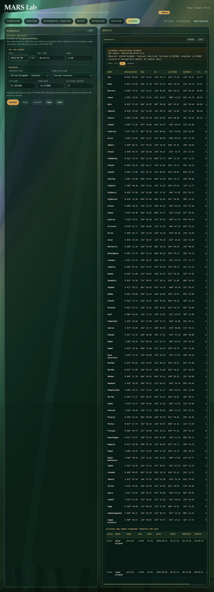

# MARS Lab

MARS Lab is the browser-based graphical client supplied with MARS. It provides
one workspace for expressions, equations, differential equations, matrices,
symbolic and numerical integration, civil date calculations and the
astronomical almanac. The browser is the presentation layer: mathematical work
is sent to the local MARS helper programs, which use MARSlib.

## Installing and starting the Lab

MARS Lab requires Python 3.10 or later and uses only its standard library; no
packages from `pip` are needed. Build MARS and install Python, SQLCipher and the
TeX rendering tools before starting the Lab:

```sh
sudo apt install python3 texlive-latex-base dvisvgm sqlcipher
make mars-lab
```

```text
MARS Lab running at http://localhost:<port>/
Press Ctrl+C to stop.
```

The port is selected automatically. Use `python3 tools/mars_lab.py --help` to
see the command-line options, including a fixed host or port and
`--no-browser`. To install the desktop launcher and its private jurisdiction
database, run `make install-mars-lab` from the repository root.

The `tools/mars-lab` launcher checks the native expression-helper build target
before it starts the client and rebuilds the helper when needed, so a restarted
development instance cannot silently reuse a stale binary.

Use `make mars-lab-stop` to stop a Lab process belonging to the current user,
or `make mars-lab-restart` after changing the native helper or client.

Each mode retains its most recent editor text, binding values and controls
between sessions. Input events save an in-progress edit as well as a submitted
calculation, so moving between modes or restarting the Lab does not restore an
older expression or equation.
The precision buttons change the working precision used by the mathematical
helpers. The result cards provide independent zoom, expansion and copy
controls; **Use as input** returns a suitable result to the editor.

On a desktop-sized screen, each mode now follows the natural page height rather
than forcing the editor and result panels into the remaining viewport. This
keeps the controls directly below their editor and avoids large artificial
blank areas. A resize grip appears only when an editor genuinely runs out of
space. Result cards still scroll or expand independently when their content
requires it.

## Expression mode

Expression mode parses, simplifies and evaluates scalar or matrix-valued
expressions. When variables are present, the buttons beneath the editor can
differentiate or integrate with respect to each variable. **Goal seek** finds a
numeric value for a selected variable.

Supported elementary functions with an explicit symbolic complex argument are
presented in Cartesian `p + qi` form. The complete set comprises `exp`, `ln`,
`lg`; the circular functions `sin`, `cos`, `tan`, `sec`, `cosec`, `cot`;
their hyperbolic counterparts; and all twelve inverse circular and inverse
hyperbolic functions. This applies to inputs written with both parts—
`exp(x + iy)` is displayed as `exp(x)·cos(y) + exp(x)·sin(y)·i`—and to
pure-imaginary inputs, for which `sin(iy)` is displayed as
`0 + sinh(y)·i`.

Logarithm input follows the calculator convention: `log(x)`, `log10(x)`, and
`lg(x)` all mean the base-10 logarithm, while `ln(x)` means the natural
logarithm. Result cards use `lg` and `ln` consistently, regardless of which
accepted alias was entered.

The derivative and integral buttons use the same separated Cartesian algebra
for differentiation or integration with respect to either component. Their
Rendered TeX, Expression and Function cards do not fall back to the original
unsplit function call. The imaginary unit is the final factor of the imaginary
term, and indefinite integrals place their constant of integration last in all
three representations.

Explicit fractional powers retain their complete root family. Their
derivatives likewise show every Cartesian branch; when bindings permit numeric
evaluation, the result card is titled **Values** and contains one value per
branch. Named `sqrt`, `cubrt` and `root` calls remain principal and
single-valued.

Additive ellipses are interpreted by the native expression parser. It first
tries exact geometric and inverse-index-power models, then uses a Lagrange
polynomial fitted to the supplied coefficient terms and verified against the
terminal term. The Rendered TeX derivation shows the inferred sigma before the
simplified formula and value. The browser neither extrapolates nor rewrites the
series.

The same native recognition covers finite `sin`, `cos`, `sinh` and `cosh`
progressions, including inputs such as
`cos(x)+cos(2x)+cos(3x)+...+cos(nx)`. MARS returns the corresponding geometric-
series closed form and uses its continuous value at removable singularities
such as `x = 0`. Integrating the cosine progression produces

$$
\frac{H_n(e^{ix})-H_n(e^{-ix})}{2i}+C,
\qquad H_n(z)=\sum_{k=1}^{n}\frac{z^k}{k}.
$$

Expression input accepts `Hn(n,z)`, `harmonic_poly(n,z)`, and `harmonicpoly(n,z)`. The Function card
uses `harmonicpoly`, and the same native node supports repeated symbolic
differentiation and direct integration.

Formal finite sums and products use `@Z_(k=1)^n term` and `@P_(k=1)^n term`.
The lower-bound parentheses may be omitted, as in `@Z_k=1^n term`;
`@Z_(k=1)^n` is the ASCII replacement for `Σ_(k=1)^n`.
Omitting the upper bound produces the corresponding infinite operator, as in
`@Z_k=1 term` or `@P_k=1 term`. The operator index is local: it does not create
a binding control. Mathematical output renders sums with Σ; Function output
uses `sum(k, 1, n, term)` when the summation itself remains the simplified
result.

Formal `sin(kx)`, `cos(kx)`, `sinh(kx)` and `cosh(kx)` sums from 1 to `n`
use the same native geometric-series identities as recognised ellipsis input.
For example, with supplied `x` and `n`, `@Z_(k=1)^n sin(kx)` displays

$$
\sum_{k=1}^{n}\sin(kx)
=\frac{\sin(nx/2)\sin((n+1)x/2)}{\sin(x/2)},
$$

and supplies its numerical Value without iterating through a large upper
bound.

The exponential progression is geometric as well:

$$
\sum_{k=1}^{n}e^{kx}
=\frac{e^x}{e^x-1}\left(e^{nx}-1\right).
$$

For `{ @Z_(k=1)^n exp(kx) | x=2; n=100000 }`, MARS Lab displays that
identity, Expression style emits
`exp(x)/(exp(x) - 1)·(exp(nx) - 1)`, and Function style evaluates the same
formula using a shared `exp(x)` temporary. Its Value is
`9.110304914770879911502042940141264278041407847643843263784059825E+86858`.
At `x = 0`, MARS evaluates the removable limit directly and returns `n`.

Products inside logarithms reduce the corresponding logarithmic progression:

$$
\sum_{k=1}^{n}\ln(kx)=n\ln(x)+\ln\Gamma(n+1).
$$

For `{ @Z_(k=1)^n ln(kx) | x=2; n=100000 }`, Expression style emits
`n·ln(x) + lnΓ(n + 1)`, Function style emits `n.ln(x) + lgamma(n + 1)`, and the
Value is
`1120613.939955116396071001320351928512056894536584146906526018233`.

Because `log` denotes the common logarithm, it remains distinct from `ln`:

$$
\sum_{k=1}^{n}\lg(kx)
=n\lg(x)+\frac{\ln\Gamma(n+1)}{\ln(10)}.
$$

For `{ @Z_(k=1)^n log(kx) | x=2; n=100000 }`, the parseable result is
`n·lg(x) + lnΓ(n + 1)/ln(10)` and the Value is
`486676.4504663690278820372835671954350107214367484924045390786799`.

The summand function now owns any exact finite-progression reducer. This keeps
the recogniser independent of function names and lets related functions reuse
the same mathematics. For example,

$$
\sum_{k=1}^{n}\operatorname{versin}(kx)
=n-\frac{\sin(nx/2)\cos((n+1)x/2)}{\sin(x/2)}.
$$

For `{ @Z_(k=1)^n versin(kx) | x=2; n=100000 }`, Expression style emits
`n - sin(nx/2)·cos(x/2·(n + 1))/sin(x/2)` and the Value is
`100000.0242173437116803434689891041295735315676686381885043434219`.
The other seven versed and haversed functions reduce through the same sine and
cosine progression operations.

The progression step may itself be a symbolic product. The recogniser removes
the local index wherever it occurs as one multiplicative factor, so `kax`,
`akx`, and `axk` all have step `ax`. For
`{ @Z_(k=1)^n sin(kax) | a=2; x=3; n=100000 }`, Expression style outputs
`sin(nax/2)·sin(ax/2·(n + 1))/sin(ax/2)` with the supplied bindings,
Function style introduces `v1 = a.x.` and evaluates
`v2 = v1/2.` before returning
`sin(n.v1/2).sin((n + 1).v1/2)/sin(v2)`, and the Value is
`-0.1868614750758504223995060240052491962444814290852506553280866826`.
Rendered TeX shows the original sigma followed by that identity. A nonlinear
argument such as `k²ax` retains another `k` after extraction and therefore
remains a formal sum.

Positive integer scaling also gives exact homogeneous progressions. In
particular,

$$
\sum_{k=1}^{n}\sqrt{kx}
=\sqrt{x}\left(\zeta(-1/2)-\zeta(-1/2,n+1)\right).
$$

For `{ @Z_(k=1)^n sqrt(kx) | x=2; n=100000 }`, Expression style emits
`√(x)·(ζ(-1/2) - ζ(-1/2, n + 1))` and the Value is
`29814463.01298576613569741465397922838928192939324835606473553721`.
The analogous cube-root reducer uses exponent `-1/3`; `abs(kx)` and `conj(kx)`
use the triangular number `n·(n + 1)/2`.

Floor and ceiling use an arithmetic progression for a proved integral step. For
`{ @Z_(k=1)^n floor(kx) | x=2; n=100000 }`, all result cards retain the native
domain-required specialisation `x·n/2·(n + 1)` and the Value is `10000100000`.

A proved small rational step `x = p/q` has a repeating residue pattern. Writing
`m = floor(n/q)` and `r = mod(n, q)`, MARS reduces

$$
\sum_{k=1}^{n}\left\lfloor\frac{pk}{q}\right\rfloor
=m\left(\frac{pq(m-1)}{2}+p+\frac{(p-1)(q-1)}{2}+pr\right)
+\sum_{s=1}^{r}\left\lfloor\frac{ps}{q}\right\rfloor .
$$

The native expression expands the last sum into no more than `q - 1` residue
indicators, so it never conceals a large term-by-term loop. For
`{ @Z_(k=1)^n floor(0.6k) | n=100000 }`, Expression style outputs
`{ ⌊n/5⌋·(15/2·(⌊n/5⌋ - 1) + 7 + 3·mod(n, 5)) + (⌊1/5·(mod(n, 5) + 3)⌋ + ⌊1/5·(mod(n, 5) + 2)⌋ + 2·⌊1/5·(mod(n, 5) + 1)⌋) | n = 100000 }`
and the Value is `2999990000`. Rendered TeX shows the original sum followed by
this equality, while Function style emits the same period formula with
temporaries for `n/5`, `floor(n/5)`, and `mod(n, 5)` rather than
`sum(k, 1, n, ...)`.

Non-integral rationals currently require reduced denominator `q <= 32` and
`|p| <= 1000000`. MARS leaves an unset, irrational, or larger rational step
formal rather than claiming a reduction it has not proved. Ceiling uses the
corresponding ceiling residues.

The weighted hyperbolic sums `@Z_k=1^n sinh(kx)/k` and
`@Z_k=1^n cosh(kx)/k` have native Lerch-transcendent forms built from Li₁ and
Φ. MARS Lab always displays the applicable form, including when a stable
large-bound evaluator supplies the Value, so the interface never suggests that
an enormous number of terms was summed directly. TeX stays on one line when
space permits, Expression output uses `Li1` and the capital symbol `Φ`, and
Function output uses `li1` and `lerchphi`. **Use as input** copies that exact
parseable Expression representation back to the editor while retaining the
supplied bindings. Differentiating the copied weighted-sinh form recognises the
identity from which it came and returns

$$
\sum_{k=1}^{n}\cosh(kx)
=\frac{\sinh(nx/2)\cosh((n+1)x/2)}{\sinh(x/2)}.
$$

The Value card evaluates the combined weighted sum through a stable native
path rather than exposing the large cancelling imaginary parts of individual
principal-branch terms. It also avoids iterating through every term for a very
large finite upper bound. The browser receives the simplified algebra,
renderings and value from MARSlib; it does not parse, simplify or substitute
the mathematics itself.

Weighted circular sums use the corresponding unit-complex Lerch form. For
example, the input

```text
{ -Σ_(k=1)^n cos(kx)/k | x = 2; n = 100000 }
```

has this Expression output:

```text
{ -½·(Li1(exp(ix)) - exp(ix)^(n + 1)·Φ(exp(ix), 1, n + 1) +
  (Li1(exp(-ix)) - exp(-ix)^(n + 1)·Φ(exp(-ix), 1, n + 1))) | x = 2; n = 100000 }
```

Its Function implementation reuses the reciprocal unit exponential:

```text
expression expr(x, const n) {
    const c1 = n + 1.

    v1 = i.x.
    v2 = exp(v1).
    v3 = 1/v2.

    return -1/2.(li1(v2) - v2^c1.lerchphi(v2, 1, c1) +
                  (li1(v3) - v3^c1.lerchphi(v3, 1, c1))).
}

x = 2.
const n = 100000.
output(expr(x, n)).
```

The accompanying Value is approximately
`0.52053867649950756146719704452337066`. An outer sign is retained in the
formula and numerical result instead of hiding recognition of the underlying
weighted sum.

The captured editor input is `1+1/2^p+1/3^p+...+1/n^p`; its binding boxes
supply `p = 2.5` and `n = 100`. MARS recognises

$$
\sum_{k=1}^{n}\frac{1}{k^p}
=\zeta(p)-\zeta(p,n+1),
$$

and the supplied bindings produce approximately
`1.3408255697514640082147074818471`. At `p = 1`, MARS uses the harmonic
formula `digamma(n + 1) + gamma` consistently in the Rendered TeX, Expression
and Function cards, with the sigma summand shown as `1/k`; non-positive integer
exponents use the corresponding Faulhaber polynomial. With `n = inf`, `p = 2`
simplifies exactly to `pi^2/6`,
while another real `p > 1` evaluates to `zeta(p)`,
while a divergent infinite series has no finite Value card. A literal infinite
terminal term such as `1/inf^2` is also accepted.

Riemann zeta accepts `zeta(s)` or `ζ(s)`. Hurwitz zeta accepts the two-argument
forms `zeta(s,a)` and `ζ(s,a)`, as well as `zetah(s,a)` and `zeta2(s,a)`.
Their first-argument derivatives use the trailing-`p` names `zetap`,
`zatahp`, and `zeta2p`.

A finite tangent progression is shown with its q-digamma identity rather than
pretending that a large explicit summation was performed symbolically. MARS
uses the reduced identity

$$
\sum_{k=1}^{n}\tan(kx)
=in+\frac{\psi_{e^{4ix}}(1)-\psi_{e^{4ix}}(n+1)-\psi_{e^{2ix}}(1)+\psi_{e^{2ix}}(n+1)}{x}.
$$

The Expression and Function cards show the same q-digamma formula. The Value
card evaluates the recognised finite combination by a stable native real sum:
the separate q-digamma terms are not assigned artificial values on the unit
circle. Using the displayed formula as input recovers the same summation,
identity, bindings and value.

Inverse circular and inverse hyperbolic progressions use log-gamma identities
where those identities are genuinely shorter than the original sum. Define

$$
D_n(s)=\ln\Gamma(n+1+s)-\ln\Gamma(1+s)
      +\ln\Gamma(1-s)-\ln\Gamma(n+1-s).
$$

Then MARS uses

$$
\sum_{k=1}^{n}\operatorname{acot}(kx)=\frac{D_n(i/x)}{2i},
\qquad
\sum_{k=1}^{n}\operatorname{acoth}(kx)=\frac{D_n(1/x)}{2},
$$

and

$$
\sum_{k=1}^{n}\operatorname{atanh}(kx)
=\frac{n\left(\ln x-\ln(-x)\right)+D_n(1/x)}{2}.
$$

For real non-zero `x`, arctangent uses the sign-aware complex-shift log-gamma identity

$$
\sum_{k=1}^{n}\operatorname{atan}(kx)
=\frac{n\pi x}{2|x|}+\frac{i}{2}\left(
\ln\Gamma\left(n+1+\frac{i}{x}\right)-\ln\Gamma\left(1+\frac{i}{x}\right)
+\ln\Gamma\left(1-\frac{i}{x}\right)-\ln\Gamma\left(n+1-\frac{i}{x}\right)
\right).
$$

This uses `ln(-ix) - ln(ix) = -iπx/|x|`, keeps the imaginary unit out of the
denominator, and preserves the principal-logarithm branches for positive and
negative real `x`. The Value card evaluates the supplied real terms directly at
the active precision, while the reduced identity remains visible in every
non-Value card. At `x = 0`, the finite sum evaluates directly to zero. Other
displayed log-gamma formulae may likewise use their finite terms to cross a
removable numerical singularity without hiding the symbolic identity.

Differentiating the arctangent progression uses the compact conjugate-pair form

$$
\frac{\psi(n+1+i/x)-\psi(1+i/x)+\psi(n+1-i/x)-\psi(1-i/x)}{2x^2}
=\sum_{k=1}^{n}\frac{k}{1+k^2x^2}.
$$

MARS evaluates its complex digamma terms through the active arbitrary-precision
backend and returns the mathematically real result. At 386 requested digits,
`{ @Z_(k=1)^n atan(kx) | x=1; n=1000000000 }` therefore returns a 386-digit
derivative Value beginning `20.6286155168239341793067112756040338`, without a
spurious imaginary residue.

The other inverse circular, inverse versed and inverse hyperbolic functions
have no shorter identity in MARS's current special-function vocabulary. Their
Rendered TeX and Expression cards therefore keep the sigma visible, and the
Function card explicitly retains `sum(...)`. With supplied finite bounds of at
most one million terms, the Value card evaluates that displayed finite sum
directly. The unchanged sigma and `sum(...)` make this numerical route visible;
they do not imply an undisplayed closed form.

Integrating an inverse-function progression likewise operates term by term and
retains the finite sigma when the resulting weighted logarithmic sum has no
shorter supported form. MARS does not attempt a large numerical sum merely to
populate the integral Value.

An exact inverse-function pole remains a numerical result rather than becoming
an absent Value. For example,
`{ @Z_(k=1)^n acoth(kx) | x=1; n=1000000000 }` contains
`acoth(1)` as its first term, so its Value is `∞`; changing `x` to `-1` gives
`-∞`. The same signed-infinity handling applies when a finite `atanh(kx)`
progression reaches `kx = 1` or `kx = -1`.

The corresponding hyperbolic-tangent progression uses a real q-digamma
identity. With `q = exp(-2x)`, MARS uses

$$
\sum_{k=1}^{n}\tanh(kx)
=n-\frac{2}{\log q}\left(\psi_q(1)-\psi_q(n+1)\right)
+\frac{4}{\log(q^2)}\left(\psi_{q^2}(1)-\psi_{q^2}(n+1)\right).
$$

For example, `{ @Z_(k=1)^n tanh(kx) | x=2; n=100000 }` displays this
identity in Rendered TeX, uses `ψq` in Expression style and `qdigamma` in
Function style, and produces
`99999.96334436219613677993759997968616482017617755510022062027824`.
Using that displayed Expression as input recovers the sum identity and the
same value.

The cotangent, secant and cosecant families use the same native q-digamma
machinery. Write

$$
D_q(a,n)=\psi_q(a)-\psi_q(a+n).
$$

Then the cotangent pair is

$$
\sum_{k=1}^{n}\cot(kx)=-in-\frac{2i}{\log q}D_q(1,n),\qquad q=e^{2ix},
$$

$$
\sum_{k=1}^{n}\coth(kx)=n+\frac{2}{\log q}D_q(1,n),\qquad q=e^{-2x}.
$$

The cosecant pair follows from
`cosec(y) = cot(y/2) - cot(y)` and
`cosech(y) = coth(y/2) - coth(y)`:

$$
\sum_{k=1}^{n}\operatorname{cosec}(kx)
=-\frac{2i}{\log q}D_q(1,n)+\frac{2i}{\log(q^2)}D_{q^2}(1,n),
\qquad q=e^{ix},
$$

$$
\sum_{k=1}^{n}\operatorname{cosech}(kx)
=\frac{2}{\log q}D_q(1,n)-\frac{2}{\log(q^2)}D_{q^2}(1,n),
\qquad q=e^{-x}.
$$

Finally, let `a = pi*i/(2*ln(q))`. The secant identities are

$$
\sum_{k=1}^{n}\sec(kx)
=\frac{i}{\log q}\left(D_q(1-a,n)-D_q(1+a,n)\right),
\qquad q=e^{ix},
$$

$$
\sum_{k=1}^{n}\operatorname{sech}(kx)
=\frac{i}{\log q}\left(D_q(1-a,n)-D_q(1+a,n)\right),
\qquad q=e^{-x}.
$$

MARS displays each identity in Rendered TeX, writes `ψq` in Expression style
and `qdigamma` in Function style, and recovers the original finite sum when the
displayed Expression is used as input. Circular values and the
shifted-argument `sech` value are evaluated through the recognised real finite
sum, avoiding unsupported unit-circle terms and spurious complex cancellation;
the remaining real-q hyperbolic forms are evaluated directly.

The result cards deliberately show different representations of one native
simplified expression:

- **Rendered TeX** shows the simplified mathematical result without bindings.
- **Expression** shows the parseable MARS expression, including variable and
  constant bindings when the input has them. Riemann and Hurwitz zeta use the
  shared mathematical symbol `ζ`, distinguished by their one- and two-argument
  forms.
- **Function** shows an evaluable MARS function. Reused expression-DAG nodes
  are named once as intermediate constants or variables before the return
  expression. A shared subexpression such as `x/2` is assigned once and reused.
  When both `exp(x)` and `exp(-x)` are needed, the second temporary reuses the
  first as `v2 = 1/v1`.
- **Value** appears whenever supplied bindings allow a numerical result. It is
  the only card that substitutes those bindings; it also appears when
  simplification proves a binding-independent value despite an unset binding.

**Use as input** takes its source from the native parseable Expression result,
not from TeX or Function presentation. Its binding-aware transfer preserves
the expression body's order and notation while applying the result bindings to
the editor controls.

[](images/mars-lab/expression.png?v=20260820-2)

Function cards use MARS syntax rather than C syntax. A full stop terminates a
statement, `.` within a statement denotes multiplication, and `/` is printed
without surrounding spaces. Constants use `const`; arrays use `array`; and
generated intermediate values use compact names such as `c1` and `v1`.
The source annotation above a generated function is enclosed by single
backticks, so it remains one valid delimited comment even when the card wraps
it over several visual lines. Two backticks remain the separate line-comment
syntax.
Typeable named constants use `@pi`, `@phi`, `@gamma`, `@tau` and `@inf`, with
their own syntax colour. Values edited in Expression-mode binding controls are
committed to the expression before evaluation, differentiation or integration.
Descriptive `$[...]` identifiers remain accepted as input aliases for
bracketed names and use the subdued off-white italic styling of variable and
constant names, but result cards do not generate the `$[...]` form.
The syntax colouring distinguishes keywords, functions, variables, numbers and
comments. Function-call brackets use the same gold hue as operators without
bold weight, while grouping brackets retain the ordinary text colour. The
colouring does not alter the copyable Function text.

## Equation mode

Equation mode tries symbolic isolation first and uses the numeric solver when a
symbolic result is unavailable. Bindings after `|` distinguish variables from
constants and supply starting values for numeric solving.

The captured input is `atan(2x) + atan(x) = pi/4`. The exact output is
`x = (sqrt(17) - 3)/4`, accompanied by its decimal value.

[](images/mars-lab/equation.png?v=20260814-3)

## Differential-equation mode

Differential-equation mode accepts ordinary and partial derivatives,
polynomial differential operators, differential forms and optional initial or
boundary conditions. MARSlib selects a matching rule and, when derivations are
enabled, returns the rule-derived working shown in the **Solver** card.

The captured input is `y'' + x^2y = 0`. The output is the Bessel basis

<div align="left">

$y = \sqrt{x}\left(C_1 J_{-1/4}\!\left(\frac{x^2}{2}\right) + C_2 J_{1/4}\!\left(\frac{x^2}{2}\right)\right).$

</div>

[](images/mars-lab/differential-equation.png?v=20260814-3)

Select **Help** in this mode for the accepted prime, `D`, partial-derivative and
differential-form notation. Arbitrary constants are preserved when the problem
has no conditions.

## Matrix mode

Matrix mode accepts complete numeric and symbolic matrix expressions. Spaces
separate columns and semicolons separate rows in compact input; comma-separated
entries are also accepted. Write matrix functions directly in the expression,
so `sin(1 2; 4 5)` means the sine of that complete matrix. The **Matrix
operation** selector provides **Evaluate expression**, **Inverse**, **Multiply
by another matrix**, **Eigenvalues**, **Eigendecompose**, **Characteristic
polynomial**, **Determinant**, **Trace**, **Rank**, **Simplify symbolic matrix**
and **Solve A X = B**. Functions such as the inverse, logarithm and
trigonometric families require a square matrix.

MARS Lab passes the entered text unchanged to
`mat_expression_from_string(...)`. MARSlib owns the complete grammar and
performs all matrix parsing and evaluation; neither the browser nor the native
MARS Lab helper interprets matrix-expression syntax.

Rendered matrix values automatically fit the available Value-card width at the
default zoom. Zoom and expansion recalculate that fit, so a wide matrix remains
visible without changing the native matrix output.

### Matrix-expression notation

Matrix expressions may be grouped and composed directly. `.` is matrix
multiplication, while `+` and `-` combine equally sized matrices. Integer,
fractional and symbolic powers use `^`; for example,
`((1 2; 3 4) - lambdaI)^x` is accepted. Where the matrix order is clear,
`lambdaI`, `lambda.I` and `lambda*I` all mean the scalar `lambda` multiplied by
the identity matrix. Matrix division is deliberately not defined because the
side on which an inverse should act would be ambiguous.

The structural function names and their aliases are:

| Operation | Accepted notation |
|---|---|
| Inverse | `inverse(A)`, `inv(A)` |
| Determinant | `det(A)`, `determinant(A)`, `|A|`, `||A||`, `‖A‖` |
| Trace | `trace(A)`, `tr(A)` |
| Transpose | `transpose(A)`, `trans(A)` |
| Conjugate transpose | `hermitian(A)`, `adjoint(A)`, `ctranspose(A)`, `conjtrans(A)`, `conjugate_transpose(A)`, `A^dagger`, `A^H`, `A^*`, `A^†`, `A†` |

Any unary scalar function supported by the native expression registry may be
written around a square matrix. This includes exponential, logarithmic,
trigonometric, inverse-trigonometric, hyperbolic, error, gamma, normal-density,
Lambert W and exponential-integral families. The parser reports the canonical
function name even when an alias such as `log`, `log10`, `Γ` or `productlog`
was entered. In particular, `log` and `log10` report the canonical base-10 name
`lg`, whereas natural logarithms report `ln`. Exact symbolic matrices are
supported where MARSlib has an exact
structured rule; otherwise, bind the entries to obtain a numeric matrix before
applying a general numeric matrix function. Symbolic exponents on supported
constant diagonalizable numeric square matrices are retained for any matrix
order; the exact `1 x 1` and eligible `2 x 2` cases additionally retain exact
spectral projectors.

Determinant bars must be paired: an input beginning with `|` or `||` without
the corresponding closing delimiter is rejected. A determinant is a scalar,
not a one-by-one matrix. The function vocabulary is recognised by MARSlib's
native collision-free lookup table; the browser does not recognise or rewrite
these names.

Scalar entries use the expression grammar. `conj(z)` and `conjugate(z)` are
equivalent to the postfix form `z^*`. Likewise, `abs(z)` and `|z|` denote the
same scalar absolute value. For a complex expression this is the modulus
`sqrt(z*z^*)`. Context distinguishes scalar absolute-value bars from the
determinant bars surrounding a matrix.

`sqrt(z)`, `cubrt(z)`, and `root(z,n)` return one principal scalar root. Exact
complex arguments are written in Cartesian `a + bi` surd form when such a form
is available. Explicit fractional-power syntax such as `z^(1/n)` instead
denotes the complete family of `n` roots when MARS Lab presents an expression
result.

Greek names may be entered as Unicode or through their ASCII aliases. Thus
`lambda`, `@lambda` and `λ` identify the same symbol and are normalised to `λ`
in output. This also applies inside compact matrix literals and identity
multiples.

Entrywise calculus uses `Dx(A)` for differentiation. Write `@S(A)dx` for an
indefinite entrywise integral with an additive constant matrix, or `@S^x(A)dx`
for the corresponding antiderivative without additive constants. Repeating a
derivative variable requests higher-order calculus, as in `Dxx(A)`, while a
suffix containing distinct variables requests ordered mixed calculus, as in
`Dxy(A)`. The variable buttons
below the editor invoke the corresponding first-order native operation. A
matrix antiderivative is displayed as `A(x) + C`, where `C` is a constant
matrix with entries such as `C₁₁`, `C₁₂`, `C₂₁` and `C₂₂`.

| Input | Output |
|---|---|
| `Dxx(x^3 xy; y^2 x^2y)` | `(6x, 0; 0, 2y)` |
| `Dxy(x^2y x*y^2; y^3 x^3y)` | `(2x, 2y; 0, 3x²)` |

For a symbolic matrix-power example, enter `A^x` with `A = (1 2; 3 4)`.
Writing

- `λ₊ = (5 + √33)/2` and `λ₋ = (5 - √33)/2`, and
- `P₊ = (A - λ₋I)/√33` and `P₋ = (λ₊I - A)/√33`,

the evaluated expression is `A^x = λ₊^x P₊ + λ₋^x P₋`. The **x derivative**
button returns
`ln(λ₊)λ₊^x P₊ + ln(λ₋)λ₋^x P₋`. The **x integral** button returns
`λ₊^x P₊/ln(λ₊) + λ₋^x P₋/ln(λ₋) + C`, where `C` is the independent constant
matrix. MARS Lab expands these projector expressions into a `2 x 2` matrix in
the result cards while retaining the exact `√33` terms.

MARSlib applies the spectral scalar rule before reconstructing the matrix. In
compact notation, `d(A^x)/dx = A^x ln(A)` and, when `ln(A)` is invertible,
`∫A^x dx = A^x inverse(ln(A)) + C`. An eigenvalue-one projector is integrated
as a linear term rather than divided by zero. The same machinery supports
ordered higher and mixed derivatives and iterated integrals, and is not limited
to `2 x 2` matrices.

<figure>
  <a href="images/mars-lab/matrix.png?v=20260815-6"></a>
  <figcaption><em>After clicking <strong>Evaluate</strong>.</em></figcaption>
</figure>

<br>

<figure>
  <a href="images/mars-lab/matrix-power-derivative.png?v=20260815-5"></a>
  <figcaption><em>After clicking <strong>x derivative</strong>.</em></figcaption>
</figure>

<br>

<figure>
  <a href="images/mars-lab/matrix-power-integral.png?v=20260815-5"></a>
  <figcaption><em>After clicking <strong>x integral</strong>.</em></figcaption>
</figure>

Result cards have distinct purposes:

- **Rendered TeX** shows the exact symbolic result. Long decimal mantissas are
  abbreviated with an ellipsis by default. Large integers use 23 significant
  digits followed by an ellipsis and an `e` exponent in the Expression and
  Function cards, for example `1.3322938598456934859438...e+45`.
  **Show more digits** reveals the complete exact integer in those cards.
  Rendered TeX instead uses a multiplication sign and a power of ten. The
  Value card is never abbreviated and wraps its complete numerical value.
- **Expression** shows the same native simplified matrix expression as a
  bracketed grid. Variable and constant bindings are placed on a separate row
  beneath the matrix, and unset bindings are shown as `?`. Copy still returns
  the complete native expression in reusable curly-brace notation.
- **Function** shows the same result as a native MARS matrix function, followed
  by the declarations and initialisations for its bindings. Repeated
  calculations shared by several entries are assigned once to intermediate
  variables and reused throughout the returned matrix.
- **Value** appears only when every matrix entry can be evaluated numerically.
  It remains hidden while a binding or integration constant is unresolved, and
  its complete numerical entries wrap within their columns rather than being
  abbreviated. For example, setting `lambda` to `3` evaluates
  `(1 2; 3 4) - lambdaI` to `(-2 2; 3 1)` without replacing the symbolic
  algebra in the other cards.

MARSlib creates all four representations from the same simplified matrix. The
browser transports, displays and compacts the native fields; it does not parse,
simplify or reinterpret the matrix mathematics.

Symbolic matrix calculus constructs expression DAGs. It does not depend on the
numeric automatic-differentiation mode: the scalar expression evaluator has a
reverse-mode gradient path, while a numeric forward-mode JVP path is a separate
future facility. The symbolic Jacobian is therefore not described as either a
JVP or a VJP.

**Use as input** copies the reusable result expression back into the Matrix
editor. **Back** and **Forward** navigate the Lab's Matrix workspace history;
the editor, selected operation and right-hand operand are retained between
sessions.

The direct symbolic forms use the same editor:

| Input | Output |
|---|---|
| `inverse(a b; c d)` | `(d/(ad-bc), -b/(ad-bc); -c/(ad-bc), a/(ad-bc))` |
| `det((1 2; 3 4) - lambdaI)` | `(1-λ)(4-λ)-6` |
| `tr(a b; c d)` | `a+d` |
| `(a b; c d)^dagger` | `(conj(a) conj(c); conj(b) conj(d))` |
| `(a b; c d).(e f; g h)` | `(ae+bg, af+bh; ce+dg, cf+dh)` |
| `inverse(a b; c d).(x; y)` | `(1/(ad-bc)(dx-by); 1/(ad-bc)(ay-cx))` |
| `Dx(ax+b cx+d; y xy)` | `(a, c; 0, y)` |
| `Dxx(x^3 xy; y^2 x^2y)` | `(6x, 0; 0, 2y)` |
| `Dxy(x^2y x*y^2; y^3 x^3y)` | `(2x, 2y; 0, 3x²)` |
| `@S(ax+b cx+d; y xy)dx` | `(½(ax²+2bx), ½(cx²+2dx); xy, ½x²y) + (C₁₁, C₁₂; C₂₁, C₂₂)` |

## Integrator mode

Integrator mode combines exact symbolic antiderivatives with the numerical
integrator. Add one bound row for each variable to be integrated. Leave both
bounds blank for an antiderivative, or enter lower and upper bounds for a
definite integral. Mark a symbol **Free** when it is a parameter rather than an
integration variable. The work-budget selector limits numerical fallback.

The captured input is `sin(x)^2` with `x` from `0` to `1`. MARS returns the
exact antiderivative `(2x - sin(2x))/4` and the definite output
`(2 - sin(2))/4`.

[](images/mars-lab/integrator.png?v=20260814-3)

## Datetime mode

Datetime mode combines civil-calendar, jurisdiction, solar, lunar and optional
weather calculations. Enter a selected date, a date range and an observer
location. A Julian day number may be used in place of the selected civil date.
The GMT offset includes daylight saving when applicable.

The captured request uses 20 August 2026 in Shrewsbury, with a date range
ending on 1 January 2027. Its output includes the weekday, sunrise and sunset,
moonrise and moonset, moon phase, clock changes, the asynchronously added
weather summary, the selected date range and the year's calendar observances.

[](images/mars-lab/datetime.png?v=20260820-1)

MARS supplies no shared WeatherAPI account or key. Weather is shown only when
the person installing MARS Lab creates their own WeatherAPI account, configures
that account's key during desktop installation, and the service can be reached.
The calendar and astronomical results do not depend on that optional service.
They are displayed as soon as the native datetime helper completes; weather is
fetched asynchronously and updates its own card afterwards, without delaying
or replacing those results.

Each lookup sends the configured key, selected date, latitude and longitude
from the local Lab server to WeatherAPI.com over HTTPS. The key is not sent to
the browser. MARS does not cache or persist the returned weather response,
although the date and coordinates remain in private local Lab state so that its
inputs can be restored. The weather card identifies WeatherAPI.com as its
source and displays the required end-user warning. Forecasts and conditions are
probabilistic and may be inaccurate for an exact place or time. Do not use them
as the sole basis for personal safety, aviation, marine navigation, emergency
planning or any other safety-critical decision; consult official
meteorological services and authorities. See the [MARS privacy notice](privacy.md),
[WeatherAPI privacy policy](https://www.weatherapi.com/privacy.aspx) and
[WeatherAPI terms](https://www.weatherapi.com/terms.aspx).

## Almanac mode

Almanac mode is the AstroNav worksheet. Enter a GMT date and time, time-zone
offset, latitude, longitude and altitude. The packaged ephemeris covers
1550–2649 GMT. Results include declination, Greenwich hour angle, right
ascension and observer-relative altitude and azimuth for the navigational
bodies.

The captured request is for London at `2026-08-08 09:02:43` GMT. The output is
the navigational-body table headed by the Sun, Moon, Mercury, Venus, Mars,
Jupiter and Saturn.

[](images/mars-lab/almanac.png)

## Mobile and private remote access

When MARS Lab listens on its normal wildcard address, its **Mobile** control
shows the best private access route currently available:

- with Tailscale active, the QR code contains the private Tailscale URL;
- otherwise, it contains a local Wi-Fi URL when one is available;
- when neither route is reachable, no mobile URL is advertised.

For access away from the local network, connect both the MARS computer and the
mobile device to the same Tailscale network, start MARS Lab, open **Mobile** and
scan the displayed code. MARS Lab configures private Tailscale Serve when it
can; it deliberately does not enable public Tailscale Funnel access. A phone
that is not connected to the same Tailscale network cannot use the private QR
code.

## Troubleshooting

- **No rendered mathematics:** install `texlive-latex-base` and `dvisvgm`, then
  restart the Lab.
- **A helper is missing:** run `make release` and restart the Lab from the
  repository root.
- **A mobile QR code is absent or unreachable:** confirm that MARS Lab is using
  the wildcard host, then check that the phone is on the same Wi-Fi network or
  Tailscale network as the computer.
- **A result is too wide:** use the result card's zoom controls. Long rendered
  mathematics is broken over lines where possible and continues vertically.
- **A previous result is still visible:** evaluate the new input or use
  **Clear**. **Back** and **Forward** navigate the Lab's own workspace history.
