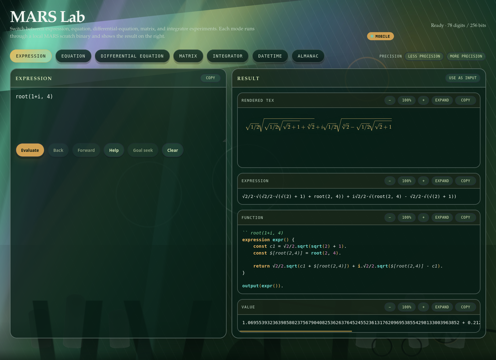
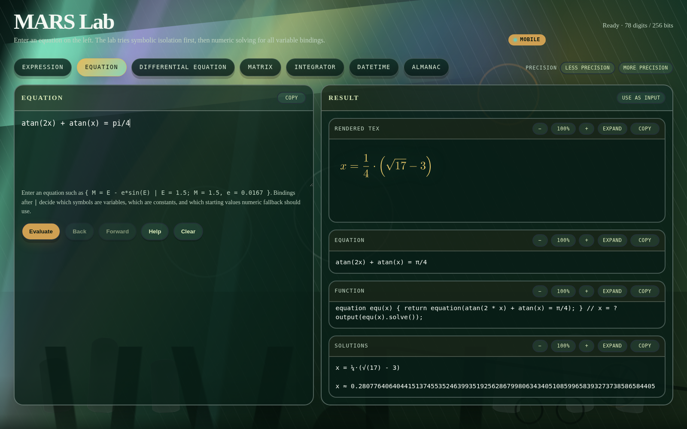
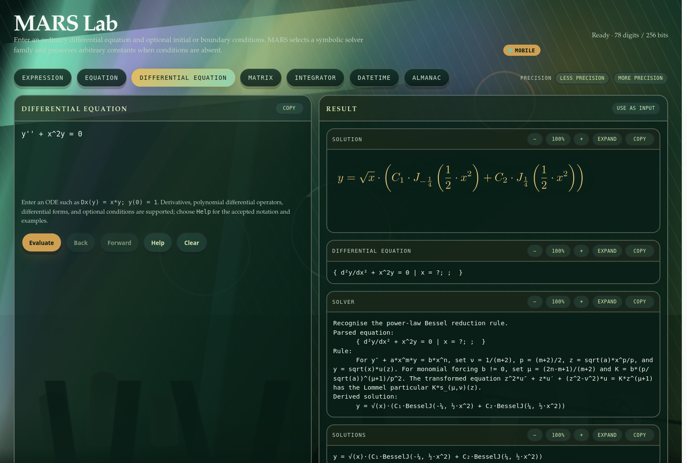
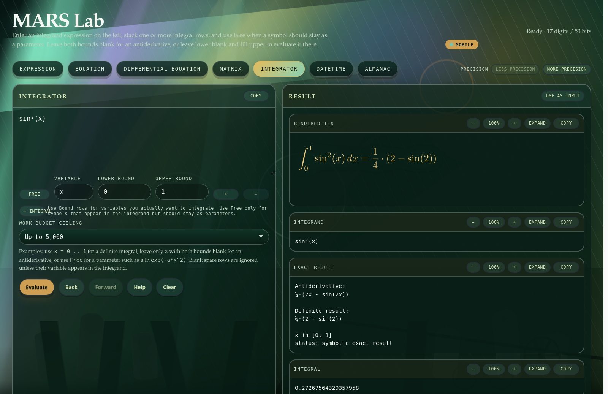
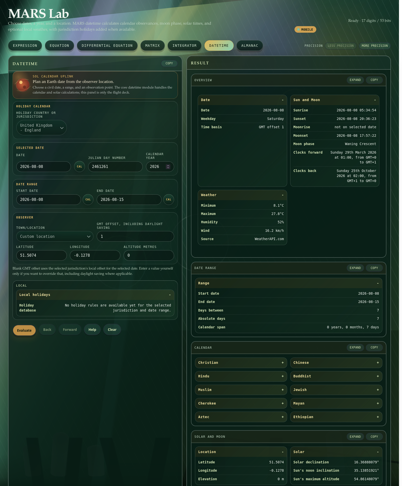

# MARS Lab

MARS Lab is the browser-based graphical client supplied with MARS. It provides
one workspace for expressions, equations, differential equations, matrices,
symbolic and numerical integration, civil date calculations and the
astronomical almanac. The browser is the presentation layer: mathematical work
is sent to the local MARS helper programs, which use MARSlib.

## Installing and starting the Lab

Build MARS and install the TeX rendering tools before starting the Lab:

```sh
make release
sudo apt install texlive-latex-base dvisvgm sqlcipher
python3 tools/mars_lab.py
```

```text
MARS Lab running at http://localhost:<port>/
Press Ctrl+C to stop.
```

The port is selected automatically. Use `python3 tools/mars_lab.py --help` to
see the command-line options, including a fixed host or port and
`--no-browser`. To install the desktop launcher and its private jurisdiction
database, run `make install-mars-lab` from the repository root.

The selected mode and recent workspace state are retained between sessions.
The precision buttons change the working precision used by the mathematical
helpers. The result cards provide independent zoom, expansion and copy
controls; **Use as input** returns a suitable result to the editor.

## Expression mode

Expression mode parses, simplifies and evaluates scalar or matrix-valued
expressions. When variables are present, the buttons beneath the editor can
differentiate or integrate with respect to each variable. **Goal seek** finds a
numeric value for a selected variable.

The captured input is `sin(x)^2 + cos(x)^2` with `x = pi/7`. MARS simplifies
the expression to the exact output `1`.

[](images/mars-lab/expression.png)

## Equation mode

Equation mode tries symbolic isolation first and uses the numeric solver when a
symbolic result is unavailable. Bindings after `|` distinguish variables from
constants and supply starting values for numeric solving.

The captured input is `atan(2x) + atan(x) = pi/4`. The exact output is
`x = (sqrt(17) - 3)/4`, accompanied by its decimal value.

[](images/mars-lab/equation.png)

## Differential-equation mode

Differential-equation mode accepts ordinary and partial derivatives,
polynomial differential operators, differential forms and optional initial or
boundary conditions. MARSlib selects a matching rule and, when derivations are
enabled, returns the rule-derived working shown in the **Solver** card.

The captured input is `y'' + x^2y = 0`. The output is the Bessel basis

\[
y=\sqrt{x}\left(C_1J_{-1/4}\!\left(\frac{x^2}{2}\right)
                 +C_2J_{1/4}\!\left(\frac{x^2}{2}\right)\right).
\]

[](images/mars-lab/differential-equation.png)

Select **Help** in this mode for the accepted prime, `D`, partial-derivative and
differential-form notation. Arbitrary constants are preserved when the problem
has no conditions.

## Matrix mode

Matrix mode accepts complete numeric and symbolic matrix expressions. Spaces
separate columns and semicolons separate rows in compact input; comma-separated
entries are also accepted. Write matrix functions directly in the expression,
so `sin(1 2; 4 5)` means the sine of that complete matrix. The **Matrix
operation** selector remains available for inverse, multiplication, solving,
eigenvalue and other structural operations while their direct notation is
still unfamiliar. Functions such as the inverse, logarithm and trigonometric
families require a square matrix.

MARS Lab passes the entered text unchanged to
`mat_expression_from_string(...)`. MARSlib owns the complete grammar and
performs all matrix parsing and evaluation; neither the browser nor the native
MARS Lab helper interprets matrix-expression syntax.

The captured input is `sin(1 2; 4 5)`. MARS returns the sine of the complete
`2 x 2` matrix, rather than applying scalar sine separately to its four
entries. At normal display precision the output is approximately
`(-0.3150025731, 0.1811582616; 0.3623165233, 0.0473139502)`.

[](images/mars-lab/matrix.png)

The direct symbolic forms use the same editor:

| Input | Output |
|---|---|
| `inverse(a b; c d)` | `(d/(ad-bc), -b/(ad-bc); -c/(ad-bc), a/(ad-bc))` |
| `(a b; c d).(e f; g h)` | `(ae+bg, af+bh; ce+dg, cf+dh)` |
| `inverse(a b; c d).(x; y)` | `((dx-by)/(ad-bc); (ay-cx)/(ad-bc))` |
| `Dx(ax+b cx+d; y xy)` | `(a, c; 0, y)` |
| `@S^x((ax+b cx+d; y xy))` | `(1/2(ax^2+2bx), 1/2(cx^2+2dx); xy, 1/2x^2y)` |

## Integrator mode

Integrator mode combines exact symbolic antiderivatives with the numerical
integrator. Add one bound row for each variable to be integrated. Leave both
bounds blank for an antiderivative, or enter lower and upper bounds for a
definite integral. Mark a symbol **Free** when it is a parameter rather than an
integration variable. The work-budget selector limits numerical fallback.

The captured input is `sin(x)^2` with `x` from `0` to `1`. MARS returns the
exact antiderivative `(2x - sin(2x))/4` and the definite output
`(2 - sin(2))/4`.

[](images/mars-lab/integrator.png)

## Datetime mode

Datetime mode combines civil-calendar, jurisdiction, solar, lunar and optional
weather calculations. Enter a selected date, a date range and an observer
location. A Julian day number may be used in place of the selected civil date.
The GMT offset includes daylight saving when applicable.

The captured request uses 8 August 2026 in England. Its output includes the
weekday, sunrise and sunset, moonrise and moonset, moon phase, clock changes,
weather summary, the selected date range and the year's calendar observances.

[](images/mars-lab/datetime.png)

Weather is shown only when a WeatherAPI key was configured during desktop
installation and the service can be reached. The calendar and astronomical
results do not depend on that optional service.

## Almanac mode

Almanac mode is the AstroNav worksheet. Enter a GMT date and time, time-zone
offset, latitude, longitude and altitude. The packaged ephemeris covers
1550–2649 GMT. Results include declination, Greenwich hour angle, right
ascension and observer-relative altitude and azimuth for the navigational
bodies.

The captured request is for London at `2026-08-08 09:02:43` GMT. The output is
the navigational-body table headed by the Sun, Moon, Mercury, Venus, Mars,
Jupiter and Saturn.

[](images/mars-lab/almanac.png)

## Mobile and private remote access

When MARS Lab listens on its normal wildcard address, its **Mobile** control
shows the best private access route currently available:

- with Tailscale active, the QR code contains the private Tailscale URL;
- otherwise, it contains a local Wi-Fi URL when one is available;
- when neither route is reachable, no mobile URL is advertised.

For access away from the local network, connect both the MARS computer and the
mobile device to the same Tailscale network, start MARS Lab, open **Mobile** and
scan the displayed code. MARS Lab configures private Tailscale Serve when it
can; it deliberately does not enable public Tailscale Funnel access. A phone
that is not connected to the same Tailscale network cannot use the private QR
code.

## Troubleshooting

- **No rendered mathematics:** install `texlive-latex-base` and `dvisvgm`, then
  restart the Lab.
- **A helper is missing:** run `make release` and restart the Lab from the
  repository root.
- **A mobile QR code is absent or unreachable:** confirm that MARS Lab is using
  the wildcard host, then check that the phone is on the same Wi-Fi network or
  Tailscale network as the computer.
- **A result is too wide:** use the result card's zoom controls. Long rendered
  mathematics is broken over lines where possible and continues vertically.
- **A previous result is still visible:** evaluate the new input or use
  **Clear**. **Back** and **Forward** navigate the Lab's own workspace history.
